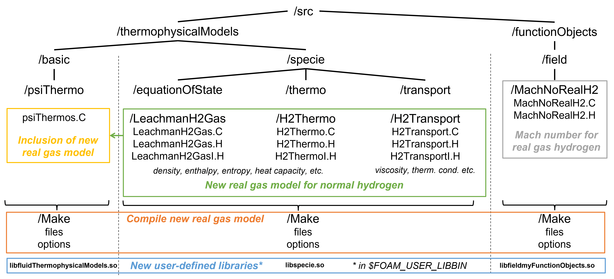
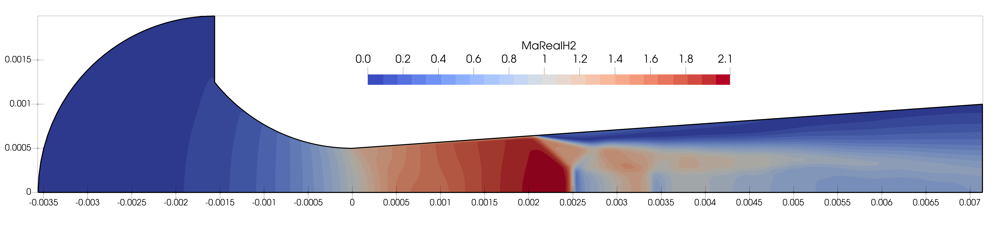

# Hydrogen-Real-Gas-Model

In this repository, a new real gas model for hydrogen based on the Reference Fluid Thermodynamic and Transport Properties Database (REFPROP) v10.0 is provided for the use in the simulation software OpenFOAM v2012. The model is valid in a temperature and pressure range of 150-400 K and 0.1-1000 bar, respectively. Usage beyond this range is not recommended as it may lead to unrealistic results.  

Results regarding the new real gas model for hydrogen have been published in the article "Derivation and validation of a reference data-based real gas model for hydrogen" [(DOI)](https://doi.org/10.1016/j.ijhydene.2023.03.073).

***

## OpenFOAM folder structure

The figure below shows the folder structure in OpenFOAM of the relevant files for the new real gas model for hydrogen. 

## Installation

For the installation of the new real gas model, the command `wmake libso` needs to be executed consecutively in the following subfolders "/specie", "/basic", and "/field". Individual adaptations of the files "files" and "options" in the respective "/Make" folder may be required.

Alternatively, a Docker container can be used that will be made available on the [MetHyInfra project website](https://www.methyinfra.ptb.de). The container will already include the OpenFOAM environment with the pre-installed real gas model. Please fill in the contact form on the website if you have any related questions.

## Tutorials

Two tutorial cases of the flow through a critical flow Venturi nozzle are located in the "/Tutorials" folder in order to show the usage of the new real gas model. 
The "/Simple_Geometry" subfolder contains a simplified geometry of a toroidal nozzle. 
The "/Meas_Cyl" subfolder contains a measured geometry of a cylindrical nozzle (from the MetHyInfra project).  

For the start of the simulation, do the following steps:
1. run `blockMesh && extrudeMesh` to create the mesh
2. run either:
    - `sonicFoam > log &` or 
    - `decomposePar` (default number of processors is 4) and then `mpirun -np 4 sonicFoam -parallel > log &` to run the simulation

For the post-processing, you might need to:

3. run `reconstructPar` (if your case was decomposed before) 
4. select the file "nozzle.foam" for the visualization in e. g. ParaView

The distribution of the real gas Mach number is displayed in the figure below (from the "Simple_Geometry" tutorial case).

## Workshop

Within the MetHyInfra project, a CFD workshop was organized in Boras, Sweden on the 15th June 2023. The "/Workshop" folder contains the documents of the third part of this workshop considering a tutorial case of a critical nozzle.
Here, the main file is the Jupyter Notebook "CFD_Workshop_MetHyInfra.ipynb" containing the pre- and post-processing steps of the demonstrated tutorial case (in the folder "/Tutorials/Meas_Cyl"). 
The subfolders "/Input" and "/Output" provide the input for and contain the output of the Jupyter Notebook. The "/Presentation" subfolder contains the presentation slides of the workshop.

## Acknowledgments
This work was supported through the Joint Research Project “Metrology infrastructure for high-pressure gas and liquified hydrogen flows”. This project (20IND11 MetHyInfra) has received funding from the EMPIR programme co-financed by the Participating States and from the European Union's Horizon 2020 research and innovation programme. 

